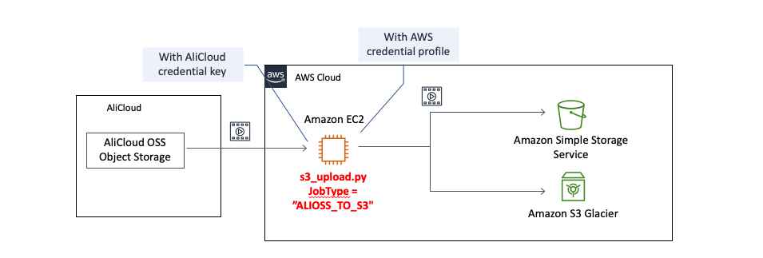
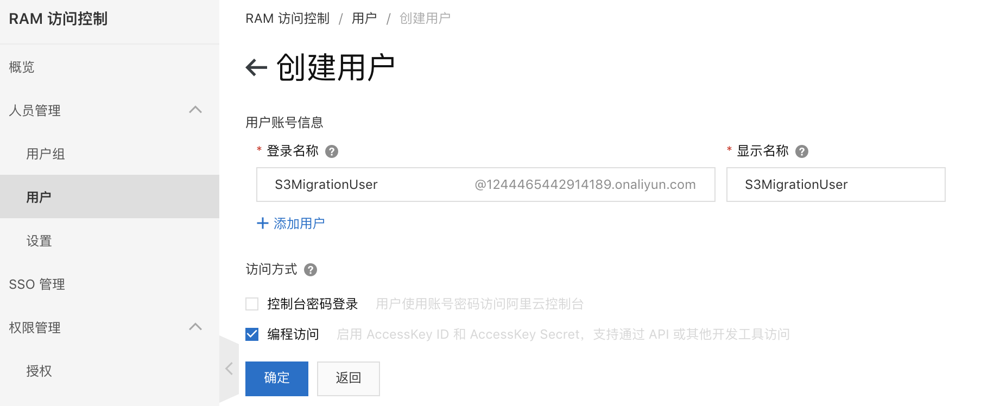
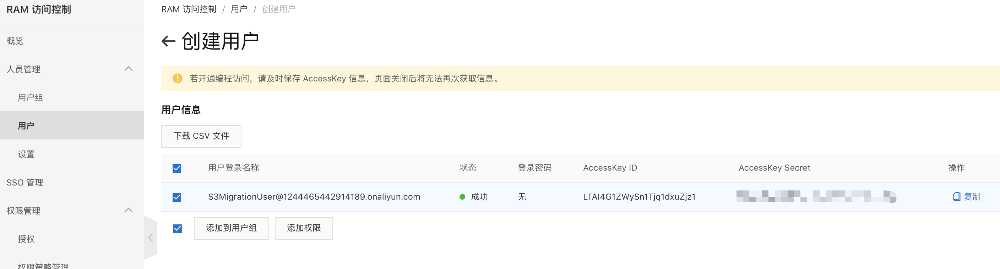
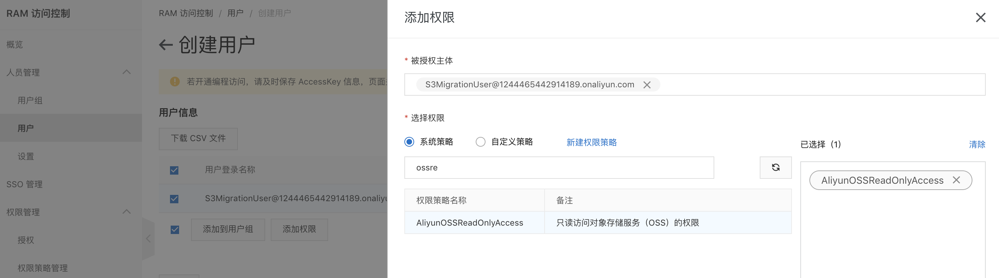
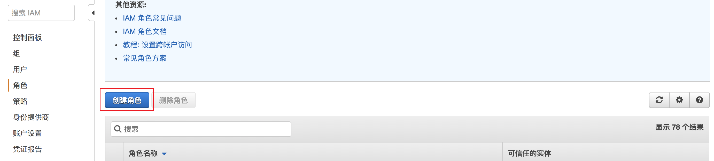
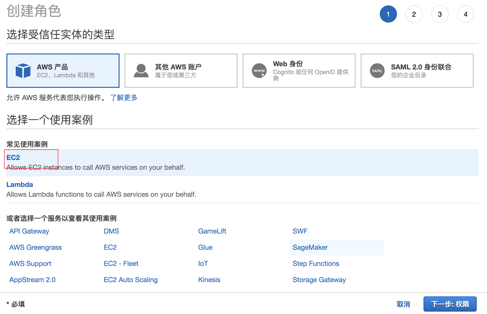
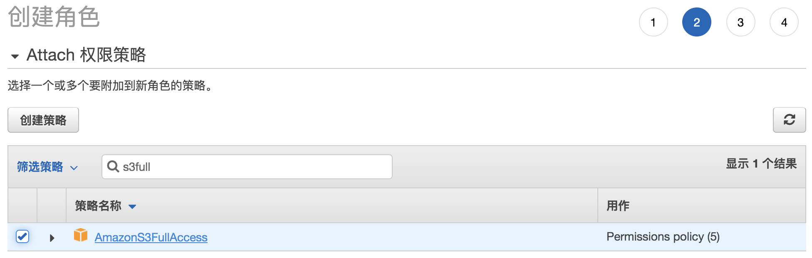
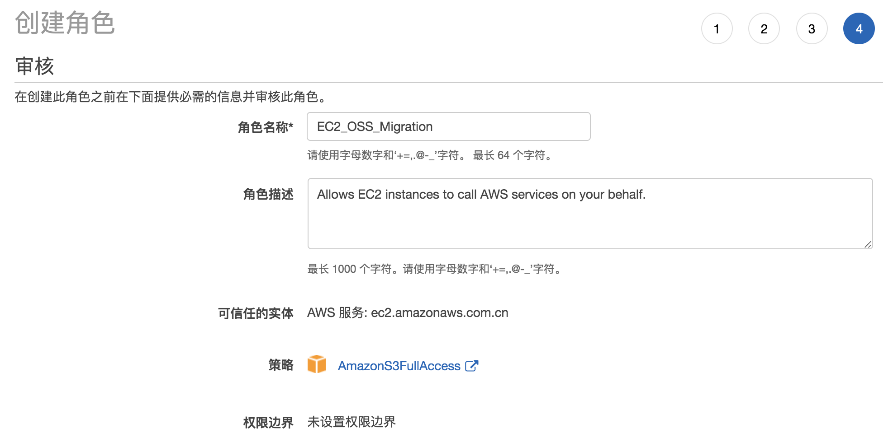

在本次实验中，我们会使用迁移工具将Ali OSS上的文件迁移到指定的S3存储桶中。
我们在此次试验中会使用的工具是amazon-s3-resumable-upload tool,它本身是一个开源工具,由AWS团队开发,主要功能包括:

* 源文件的自动分片获取，多线程并发上传到目的S3再合并文件，断点续传(分片级别)。
* 支持的源：本地文件、Amazon S3、阿里云 OSS
* 支持的目的地：Amazon S3、本地文件
* 多文件并发传输，且每个文件再多线程并发传输，充分压榨带宽。S3_TO_S3 或 ALIOSS_TO_S3 中间只过中转服务器的内存，不落盘，节省时间和存储。
* 网络超时自动多次重传。重试采用递增延迟，延迟间隔=次数\*5秒。程序中断重启后自动查询S3上已有分片，断点续传(分片级别)。每个分片上传都在S3端进行MD5校验，每个文件上传完进行,分片合并时可选再进行一次S3的MD5与本地进行二次校验，保证可靠传输。
* 自动遍历下级子目录，也可以指定单一文件拷贝。
* 可设置S3存储级别，如：标准、S3-IA、Glacier或深度归档。
* 可设置输出消息级别，如设置WARNING级别，则只输出你最关注的信息
。

OSS迁移的的整体方案架构如下图：

本次实验中，我们会进行如下的操作：

* 账号准备工作
  - 准备Ali 平台上的迁移账号
  - 准备AWS 平台上的迁移账号
* 准备迁移主机用于OSS的迁移
  - 准备具有S3写权限的EC2主机
  - 下载工具代码,配置相关参数
* 迁移验证和其他设置

## 账号准备工作
### Ali 平台账号准备
从Ali OSS 迁移的账号只要求有OSS 中对应Bucket的只读权限即可,可以使用现有任何具备AliyunOSSReadOnlyAccess权限的账号,也可以新建专用账号用于迁移.
1. 创建迁移用户
   在ali云控制台中找到RAM-访问控制,点击用户--创建用户,在创建用户界面输入登陆名称**OSSMigrationUser**和显示名称**OSSMigrationUser**,在访问方式中选择编程访问.
   
   点击确认完成
    创建完成后,务必记录用户信息中的Accesskey ID和 Accesskey Secret
    
2. 为账号增加OSS桶的访问权限
   接着在用户信息界面中点击添加权限,在选择策略搜索框中检索ossread,找到AliyunOSSReadOnlyAccess,点击确定(实际生产环境中可以进一步精简到指定桶的权限)
   
至此我们完成了在Ali 平台上创建OSS前期账号的准备工作
### AWS 平台账号/角色准备
由于需要将Ali OSS桶中数据写入到S3中,因此需要创建一个账号/角色,使其拥有S3桶对应Bucket的写入权限.我们这里使用EC2作为迁移主机,因此需要为主机创建并分配S3写入桶的角色.
1. 在AWS 控制台中找到IAM 点击角色,选择创建角色
   
   在创建角色中选择EC2作为使用对象
   
   点击下一步权限,进入权限选择,在权限选择中我们可以创建策略并给予相应的权限,也可以使用平台上内嵌的策略,这里我们使用内建策略(生产环境中可以根据安全需要创建更加细粒度的权限)

   筛选策略搜索框中搜索S3Full,找到**AmazonS3FUllAccess**,并选中
   
   点击下一步标签,输入响应的key 和value,进入下一步审核

   在审核页面中为这个角色命名为**EC2_OSS_Migration**,点击创建角色,即完成角色创建工作
   