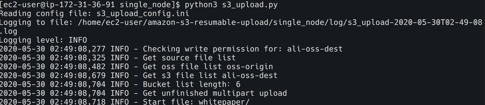

## 准备迁移主机用于OSS的迁移
1. 创建虚拟机
   在AWS控制台EC2界面中,点击启动实例开始创建EC2主机,这里选择**Amazon Linux 2 AMI (HVM)**
   
   实例类型选择,可以根据实际环境选择合适大小内存的虚拟机,这里我们选择**t2.medium**
   
   在实例配置详情中,我们将EC2主放置在默认VPC或者可以访问互联网的网段中

   在**配置实例详细信息**中,将IAM角色选择之前创建的**EC2_OSS_Migration**
   

   在高级详细信息中,的用户数据内,输入以下内容
```
#!/bin/bash
echo y | sudo amazon-linux-extras install python3
sudo yum -y install git
```

*如果你选用了其他AMI或者本地环境,请使用以下代码进行Python3和Git的安装*

```
yum install epel-release 
yum install https://centos7.iuscommunity.org/ius-release.rpm
install python36u
ln -s /bin/python3.6 /bin/python3
yum install python36u-pip
ln-s /bin/pip3.6 /bin/pip3
sudo yum -y install git
pip3 install oss2
```

在存储的界面中,保持默认即可(在迁移的过程中,数据不落盘.无需额外磁盘空间)

在安全组选项中选择默认创建新的安全组(只允许TCP 22端口),点击审核启动,创建完成EC2虚拟机.
2. 安装迁移工具
   待EC2启动完成后,使用对应key SSH登陆到EC2中
检查python3和Git已安装完成
```
python3 --version
git --version

```
确认环境就绪后,使用以下代码进行amazon-s3-resumable-upload工具安装
```
pip3 install -i https://pypi.tuna.tsinghua.edu.cn/simple boto3 --user #如果使用Amazon AMI 则无需安装
pip3 install -i https://pypi.tuna.tsinghua.edu.cn/simple oss2 --user
git clone https://github.com/aws-samples/amazon-s3-resumable-upload.git
cd amazon-s3-resumable-upload
pip3 install -r requirements.txt --user
```
此外我们还需要为该主机生成一个默认的AWS CLi profile,使用
```
aws configure
```
命令创建一个profile,如果使用Role,只需要在Region中输入*cn-northwest-1*,即可,如果不使用Role则需要输入创建的AK/SK,最后检查~/.aws文件夹中是否有Profile

至此迁移工具主机上的环境和工具已经就绪,接下来开始配置迁移工具
3. 配置迁移参数
首先进入amazon-s3-resumable-upload目录,默认就是当前目录

进入single_node/文件夹,找到s3_upload_config.ini文件,为了安全起见,我们可以先讲该文件备份一份

我们使用node或者vi工具修改该文件,主要需要修改的参数包括:
```
JobType = ALIOSS_TO_S3
SrcFileIndex = "*" #表示所有文件
S3Prefix =  #表示指定的OSS上的文件夹,如果留空表示的OSS bucket下所有的文件,这个Prefix也会同步到S3中
DesProfileName = default
DesBucket = "ali-oss-dest" #AWS上的目地桶,根据需要修改
ali_SrcBucket = "oss-origin" # 阿里云OSS源Bucket,根据需要修改
ali_access_key_id = "LTAI4G1ZWySn1Tjq1dxuZjz1" # 阿里云 RAM 用户访问密钥
ali_access_key_secret = "z04y6NPCC4aaza8mT3YY4TZTxJEDXa"
ali_endpoint = "oss-cn-zhangjiakou.aliyuncs.com" # OSS 区域 endpoint，在OSS控制台界面可以找到
```
至此迁移工具主机上的工具已经配置完成,下一步我们准备迁移

## 开始迁移工作
在single_node目录下,输入*python3 s3_upload.py*开始迁移

所有工作迁移完成后,会提示如下结果,点击回车退出


我们回到AWS 控制台中,在S3桶中可以看到所有数据已经迁移完成
